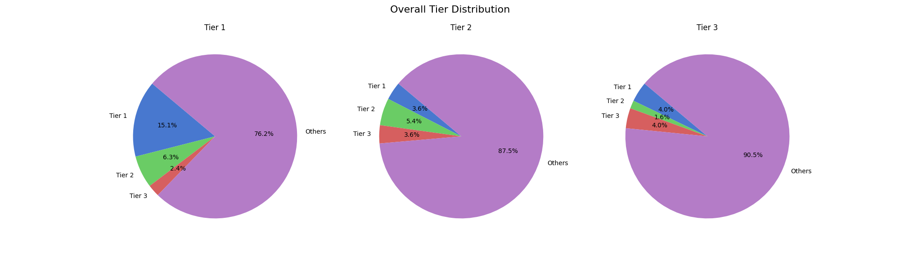
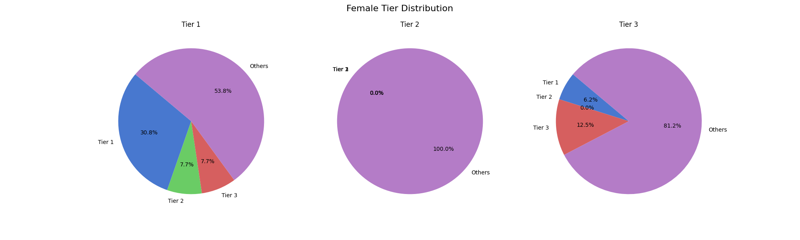
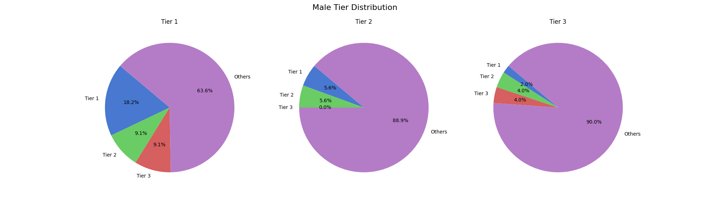

# Hierarchy in US Faculty Hiring: Evidence from 2023-2021 Economics Ph.D. Placement 
<h3 align="center" id="heading"> 12 October 2023   
<em> Python, Big Data, and Databases (ECO395m)  </em>   <h3>
<h3 align="center" id="heading"> Yundi Xiao, Yalun Wang, Vimoli Mehta </h3>

<h3>Introduction </h3>
This project is inspired by the finding of the paper “Quantifying Hierarchy and Dynamics in US Faculty Hiring and Retention” -- "Faculty hiring networks in the United States exhibit a steep hierarchy in academia and across all domains and fields, with only 5–23% of faculty employed at universities more prestigious than their doctoral university.” We are interested in whether faculty hiring in the Economics department in the U.S. established the same pattern — limited mobility between the tier of faculties’ Ph.D. school and academic placement. The project also aims to investigate if gender plays a role in Ph.D. hiring. 
<h3> Sources of Data </h3>
Sources of data include placement information from 24 top Economics departments across the US.  Ranking for the Economics PhD programs was obtained from US.News(2022), and we pick top 3 tiers of universities.The final list of universities considered were:

Tier 1:

1.Harvard University

2.Stanford University

3.Princeton University

4.University of California, ​Berkeley

5.University of Chicago

6.Yale University

7.Northwestern University

8.Columbia University

9.University of Pennsylvania

10.New York University

Tier 2:

11.University of California, ​Los Angeles

12.Cornell University

13.Boston University

14.Boston College

15.University of Rochester

16.University of Virginia

17.Vanderbilt University

18.Washington University in St Louis

19.Duke University

20.Brown University

Tier 3: 

21.University of California, Davis

22.University of Minnesota, Twin Cities

23.University of California, ​San Diego

24.Pennsylvania State University, ​University Park

We scraped data from each university’s Ph.D. placement page, focusing on the student’s name, placement year, and placement. We cleaned the data set by dropping the observations with non-academic placement. We also add the gender variable by using Gender_Guesser. API, which generates the guessed gender from the name of each observation. 

<h3> Running the code </h3>
Our code will be executed in a Python environment and using packages specified in requirements.txt. You can install those packages we use in the project by using “pip install -r requirements.txt”. We have a sequence for running these .py files in the code folder.  You can get the result we have by doing so: 
First, run “scrape.py” to get rawdata from those universities’ url, the rawdata will be in artifacts/rawplacement.csv
Second, run “wrangling. py”, this file will first combine two data sets together( the one is rawdata we collect from first step, the other one is two universities’ data that are not scrappable and we collect it by hand, and it is artifacts/Uchi PSU.csv), the combined data is artifacts/rawplacement_combined.csv, and then clean the data by dropping some data we do not need. Besides, we add the gender column by prediction and finally write it into artifact/cleaned_placement.csv.
Third, run “panda.py”, to define the Tier of School, and adding Tier columns by classifying sample’s school tier(including the school he is from and the school he works for) and we will 
have a updated cleaned_placement.csv.
Forth, run “analysis_graph.py”, and we will get 3 pie charts in the analysis folder.

<h3> Limitations </h3> 
<ol>
  <li>Proper Cleaning: While scraping, we realized that data provided by universities for their placement of PhD candidates differs widely. For example, UCSD (University of California - San Diego) directly displayed a candidate working at UT Austin LBJ School. This data was indeed valuable to us, but since the name of the school has been used as an acronym, it was difficult for us to find such acronyms while cleaning the scraped dataset. The cleaning code involves looking for keywords like "university" and "college," but it can't catch keywords like "UT" as it would be extremely specific.</li>
  <li>Imbalance of Dataset: This analysis could be improved by having an equal proportion of universities from different tiers. While we have a list of universities that can be categorized into Tier-1, Tier-2, and Tier-3, not all universities were scrapable. Also, from the list of Tier-1 universities, it might be possible that we have more PhD candidates pursuing the academic profession than the PhD candidates from Tier-2. This leads to an imbalance in the dataset and can lead to biased observations.</li>
  <li>Gender Detection and Prediction: For displaying the ratio of men and women candidates pursuing an academic profession, we used a Gender Detection library from Python to predict the gender based on names we scraped. The accuracy of the library is not going to be 100%, as there are many names that can be assigned to both genders.</li>
</ol>

In this project, we have collected 24 universities’ (including school data from Tier1, Tier2 and Tier3), this is not enough, since school in Tier4, Tier5 all also of high quality, and we only collect data from 2023 and 2022. Besides, when cleaning the data, we have error for some specific samples. For example, there is a placement :“Korea Capital Market Institute, South Korea, (Research Fellow)”, since it has “Institute” , code will include this sample to the cleaned_data. But the number of error samples is not so big. Moreover, we only define Tier1, Tier2, Tier3 with universities in the US, so when classifying placement into Tiers, we will treat top schools outside the US into “Other Tier”. In addition, for the gender_guessing part: (1) we have universities do not offer name information. For these data, we can not do the prediction. (2) the gender_guesser API has a limitation that it only work smoothly with European names and American names. For Chinese names and names from other countries, it can not make a good prediction. A further project can include: (1) collect data from more universities; (2) collect data from more years; (3) add more conditions for sifting the data we need; (4) add top schools outside the US, when defining the Tiers; (5) using specific gender_guesser API for people with different feature of name, or link Chat_GPT into this project to do the gender_guessing part if it can increase the accuracy of gender prediction.
Also, delivering such project with respect to other department will be also meaningful, and we can make comparison between departments in further study.

<h3> Methodology </h3> 
In this project, we scrape our Phd placement data from economics department. We have year, school_name, student’s name, placement, these 4 variables to restore information we need in analyze. For“placement” variable, it varies a lot among universities, so we have to make a list of words we want (like professor, university, and so on), and a list of words we do not want(like postdoc, because we do not want include postdoc samples into analysis). Then filter placements that have words we want and don’t have word we do not want, and add those samples in cleaned data. In addition, using gender_guesser API to get gender information. Then, classify universities into different tiers and add columns carrying tier information in data set, and the final data is [[university name, year, student name,placement, gender, school_tier,placement_tier ]... ...]
<h3> Results </h3> 
This involves all the Ph.D. Economic candidates and a trend is observed to see what proportion of Tier-1 Phd Candidates can maintain the same position and work in same group universities once they graduate. We have used two methods , one pie chart  and second Sankey Diagram using the plotly library in python. The Sankey Diagram is an interactive graph which displays the proportion when we hover over the line.

It is interesting to see that 15.1 % ( Out of 126, 19 still in Tier-1) of all candidates from Tier-1 universities are placed in Tier-1 universities as well. It is also evident that the pool of our data is less and thus the universities categorized as others has most percentage of candidates. As a candidate pursuing PhD from US wouldn’t necessarily remain in the US, the school outside US and below Tier-3 category are considered as others.
However, 3.6% candidates from Tier-2 get placed to Tier-1 and 4% of Tier-3 candidates get placed to Tier-1 universities suggesting there is still hope 😊
The ratio of Tier-x : Tier -x keeps on declining as we progress further. 

We also wanted to observe if there is a difference in the ratio of placement universities for men and women in the dataset. In total, we have 97 male candidates and 18% i.e 17 males still secured Tier-1 placements. However, 9.09 % secured placements in Tier-2 and Tier-3 universities. 

Similarly, we were able to identify 35 females out of which 10 ( 30%) females secured Tier-1 placements, this was astonishing to know. However, to get a better analysis we will require the candidates to be in proper proportion. Also, 7.69% of females secured placements in Tier-2 and Tier-3 each which is less in comparison to the male ratio.

<h3> Conclusion </h3> 
From the results, we can derive that there is a 23% chance that if you are in Top Tier -1 universities you would result in top-3 tier universities, and it doesn’t mean that if you are not able to secure a Tier-1 or Tier 2 university for PhD there is still a high chance you can be secured in a university greater than your current university.
